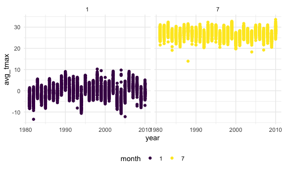

p8105_hw3_zo2168
================
Zhengkun Ou
2024-10-12

``` r
skimr::skim(ny_noaa)
```

|                                                  |         |
|:-------------------------------------------------|:--------|
| Name                                             | ny_noaa |
| Number of rows                                   | 2595176 |
| Number of columns                                | 7       |
| \_\_\_\_\_\_\_\_\_\_\_\_\_\_\_\_\_\_\_\_\_\_\_   |         |
| Column type frequency:                           |         |
| character                                        | 3       |
| Date                                             | 1       |
| numeric                                          | 3       |
| \_\_\_\_\_\_\_\_\_\_\_\_\_\_\_\_\_\_\_\_\_\_\_\_ |         |
| Group variables                                  | None    |

Data summary

**Variable type: character**

| skim_variable | n_missing | complete_rate | min | max | empty | n_unique | whitespace |
|:--------------|----------:|--------------:|----:|----:|------:|---------:|-----------:|
| id            |         0 |          1.00 |  11 |  11 |     0 |      747 |          0 |
| tmax          |   1134358 |          0.56 |   1 |   4 |     0 |      532 |          0 |
| tmin          |   1134420 |          0.56 |   1 |   4 |     0 |      548 |          0 |

**Variable type: Date**

| skim_variable | n_missing | complete_rate | min        | max        | median     | n_unique |
|:--------------|----------:|--------------:|:-----------|:-----------|:-----------|---------:|
| date          |         0 |             1 | 1981-01-01 | 2010-12-31 | 1997-01-21 |    10957 |

**Variable type: numeric**

| skim_variable | n_missing | complete_rate |  mean |     sd |  p0 | p25 | p50 | p75 |  p100 | hist  |
|:--------------|----------:|--------------:|------:|-------:|----:|----:|----:|----:|------:|:------|
| prcp          |    145838 |          0.94 | 29.82 |  78.18 |   0 |   0 |   0 |  23 | 22860 | ▇▁▁▁▁ |
| snow          |    381221 |          0.85 |  4.99 |  27.22 | -13 |   0 |   0 |   0 | 10160 | ▇▁▁▁▁ |
| snwd          |    591786 |          0.77 | 37.31 | 113.54 |   0 |   0 |   0 |   0 |  9195 | ▇▁▁▁▁ |

``` r
ny_noaa = janitor::clean_names(ny_noaa)
ny_noaa_1 <- 
  ny_noaa |>
  mutate(year = year(date),
         month = month(date),
         day = day(date),
         prcp = prcp / 10, # Convert precipitation from tenths of mm to mm
         tmax = as.numeric(tmax) / 10, #conver minumum temperature from tenths of degress C to degree C
         tmin = as.numeric(tmin) / 10  #Convert minimum temperature from tenths of degrees C to degrees C
  )
```

``` r
ny_noaa_1 |>
  count(snow) |>
  slice_max(n, n = 1)
```

    ## # A tibble: 1 × 2
    ##    snow       n
    ##   <int>   <int>
    ## 1     0 2008508

most oserved snowfall is 0.

``` r
month_jan_july = 
  ny_noaa_1 |>
  filter(month %in% c(1, 7))

ave_tmax = 
  month_jan_july |> 
  group_by(id, year, month) |>
  summarise(avg_tmax = mean(tmax, na.rm = TRUE))
```

    ## `summarise()` has grouped output by 'id', 'year'. You can override using the
    ## `.groups` argument.

``` r
ave_tmax |>
  ggplot(aes(x = year, y = avg_tmax)) +
  geom_point(aes(color = id)) +
  facet_grid(~month)
```

    ## Warning: Removed 5970 rows containing missing values or values outside the scale range
    ## (`geom_point()`).

<!-- -->
