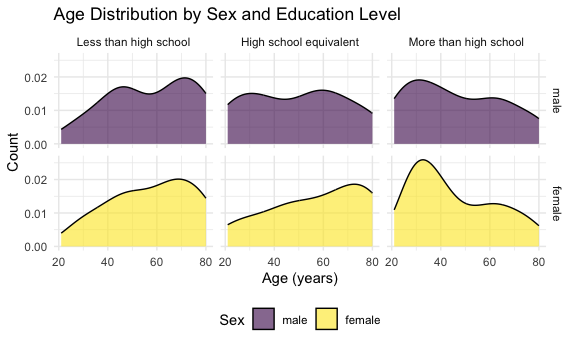

p8105_hw3_zo2168
================
Zhengkun Ou
2024-10-12

# Question 1

``` r
data("ny_noaa")
skimr::skim(ny_noaa)
```

|                                                  |         |
|:-------------------------------------------------|:--------|
| Name                                             | ny_noaa |
| Number of rows                                   | 2595176 |
| Number of columns                                | 7       |
| \_\_\_\_\_\_\_\_\_\_\_\_\_\_\_\_\_\_\_\_\_\_\_   |         |
| Column type frequency:                           |         |
| character                                        | 3       |
| Date                                             | 1       |
| numeric                                          | 3       |
| \_\_\_\_\_\_\_\_\_\_\_\_\_\_\_\_\_\_\_\_\_\_\_\_ |         |
| Group variables                                  | None    |

Data summary

**Variable type: character**

| skim_variable | n_missing | complete_rate | min | max | empty | n_unique | whitespace |
|:--------------|----------:|--------------:|----:|----:|------:|---------:|-----------:|
| id            |         0 |          1.00 |  11 |  11 |     0 |      747 |          0 |
| tmax          |   1134358 |          0.56 |   1 |   4 |     0 |      532 |          0 |
| tmin          |   1134420 |          0.56 |   1 |   4 |     0 |      548 |          0 |

**Variable type: Date**

| skim_variable | n_missing | complete_rate | min | max | median | n_unique |
|:---|---:|---:|:---|:---|:---|---:|
| date | 0 | 1 | 1981-01-01 | 2010-12-31 | 1997-01-21 | 10957 |

**Variable type: numeric**

| skim_variable | n_missing | complete_rate |  mean |     sd |  p0 | p25 | p50 | p75 |  p100 | hist  |
|:--------------|----------:|--------------:|------:|-------:|----:|----:|----:|----:|------:|:------|
| prcp          |    145838 |          0.94 | 29.82 |  78.18 |   0 |   0 |   0 |  23 | 22860 | ▇▁▁▁▁ |
| snow          |    381221 |          0.85 |  4.99 |  27.22 | -13 |   0 |   0 |   0 | 10160 | ▇▁▁▁▁ |
| snwd          |    591786 |          0.77 | 37.31 | 113.54 |   0 |   0 |   0 |   0 |  9195 | ▇▁▁▁▁ |

``` r
ny_noaa = janitor::clean_names(ny_noaa)
ny_noaa_1 <- 
  ny_noaa |>
  mutate(year = year(date),
         month = month(date),
         day = day(date),
         prcp = prcp / 10, # Convert precipitation from tenths of mm to mm
         tmax = as.numeric(tmax) / 10, #conver minumum temperature from tenths of degress C to degree C
         tmin = as.numeric(tmin) / 10  #Convert minimum temperature from tenths of degrees C to degrees C
  )
```

``` r
ny_noaa_1 |>
  count(snow) |>
  slice_max(n, n = 1)
```

    ## # A tibble: 1 × 2
    ##    snow       n
    ##   <int>   <int>
    ## 1     0 2008508

most oserved snowfall is 0.

``` r
month_jan_july = 
  ny_noaa_1 |>
  filter(month %in% c(1, 7))|>
  mutate(month = as.factor(month))

ave_tmax = 
  month_jan_july |> 
  group_by(id, year, month) |>
  filter(!is.na(tmax)) |>
  summarise(avg_tmax = mean(tmax, na.rm = TRUE))
```

    ## `summarise()` has grouped output by 'id', 'year'. You can override using the
    ## `.groups` argument.

``` r
ggplot(ave_tmax, aes(x = year, y = avg_tmax), group = id) +
  geom_point(aes(color = month)) + 
  facet_grid(~ month)
```


The mean temperature in January is much lower than the mean temperature
in July for all stations and across all years.

``` r
hex_1 = 
  ny_noaa %>% 
  ggplot(aes(x = tmin, y = tmax)) + 
  geom_hex()

hex_1
```


# Question 2

``` r
demo_df <- read_csv(file = "https://p8105.com/data/nhanes_covar.csv", 
                    skip = 4,
                    na = c(".", "NA","")) |> janitor::clean_names()
```

    ## Rows: 250 Columns: 5
    ## ── Column specification ────────────────────────────────────────────────────────
    ## Delimiter: ","
    ## dbl (5): SEQN, sex, age, BMI, education
    ## 
    ## ℹ Use `spec()` to retrieve the full column specification for this data.
    ## ℹ Specify the column types or set `show_col_types = FALSE` to quiet this message.

``` r
acc_df <- read_csv("https://p8105.com/data/nhanes_accel.csv") |> janitor::clean_names()
```

    ## Rows: 250 Columns: 1441
    ## ── Column specification ────────────────────────────────────────────────────────
    ## Delimiter: ","
    ## dbl (1441): SEQN, min1, min2, min3, min4, min5, min6, min7, min8, min9, min1...
    ## 
    ## ℹ Use `spec()` to retrieve the full column specification for this data.
    ## ℹ Specify the column types or set `show_col_types = FALSE` to quiet this message.

Load, tidy, merge, and organize the data sets:

``` r
demo_df_filtered <- 
  demo_df |>
  filter(age >= 21) |>
  filter(!is.na(sex) & !is.na(age) & !is.na(bmi) & !is.na(education)) |>
   mutate(
    sex = as.factor(case_match(sex, 
                               1 ~ "male",
                               2 ~ "female"
                               )),
    education = as.factor(case_match(education, 
                                     1 ~ "Less than high school",
                                     2 ~ "High school equivalent",
                                     3 ~ "More than high school"))) |>
  mutate(sex = factor(sex, levels = c("male", "female")), 
         education = factor(education, levels = c("Less than high school", "High school equivalent", "More than high school")))
    
  

#ensures that only participants who have both accelerometer data and demographic data are retained.
final_dataset_inner <- acc_df %>%
  inner_join(demo_df_filtered, by = "seqn")

final_dataset <- final_dataset_inner |>
  relocate(seqn, sex, education, bmi, age)

head(final_dataset)
```

    ## # A tibble: 6 × 1,445
    ##    seqn sex    education   bmi   age  min1  min2  min3  min4   min5   min6  min7
    ##   <dbl> <fct>  <fct>     <dbl> <dbl> <dbl> <dbl> <dbl> <dbl>  <dbl>  <dbl> <dbl>
    ## 1 62161 male   High sch…  23.3    22 1.11  3.12  1.47  0.938 1.60   0.145  2.10 
    ## 2 62164 female More tha…  23.2    44 1.92  1.67  2.38  0.935 2.59   5.22   2.39 
    ## 3 62169 male   High sch…  20.1    21 5.85  5.18  4.76  6.48  6.85   7.24   6.12 
    ## 4 62174 male   More tha…  33.9    80 5.42  3.48  3.72  3.81  6.85   4.45   0.561
    ## 5 62177 male   High sch…  20.1    51 6.14  8.06  9.99  6.60  4.57   2.78   7.10 
    ## 6 62178 male   High sch…  28.5    80 0.167 0.429 0.131 1.20  0.0796 0.0487 0.106
    ## # ℹ 1,433 more variables: min8 <dbl>, min9 <dbl>, min10 <dbl>, min11 <dbl>,
    ## #   min12 <dbl>, min13 <dbl>, min14 <dbl>, min15 <dbl>, min16 <dbl>,
    ## #   min17 <dbl>, min18 <dbl>, min19 <dbl>, min20 <dbl>, min21 <dbl>,
    ## #   min22 <dbl>, min23 <dbl>, min24 <dbl>, min25 <dbl>, min26 <dbl>,
    ## #   min27 <dbl>, min28 <dbl>, min29 <dbl>, min30 <dbl>, min31 <dbl>,
    ## #   min32 <dbl>, min33 <dbl>, min34 <dbl>, min35 <dbl>, min36 <dbl>,
    ## #   min37 <dbl>, min38 <dbl>, min39 <dbl>, min40 <dbl>, min41 <dbl>, …

reader-friendly table for the number of men and women in each education
category:

``` r
gender_education_table <- demo_df_filtered |>
  janitor::tabyl(education, sex) |>
  knitr::kable()
gender_education_table
```

| education              | male | female |
|:-----------------------|-----:|-------:|
| Less than high school  |   27 |     28 |
| High school equivalent |   35 |     23 |
| More than high school  |   56 |     59 |

visualization of the age distributions for men and women in each
education category:

``` r
ggplot(final_dataset, aes(x = age, fill = sex)) +
  geom_density(alpha = 0.6) +
  facet_grid(sex ~ education) +
  labs(
    title = "Age Distribution by Sex and Education Level",
    x = "Age (years)",
    y = "Count",
    fill = "Sex"
  ) 
```



``` r
ggplot(final_dataset, aes(x = education, y = age, fill = sex)) +  
  geom_boxplot(alpha = 0.3) +
   labs(
    title = "Boxplot by Sex and Education Level",
    x = "Education",
    y = "age",
    fill = "Sex")
```


Education level appears to influence the age distribution, with a higher
proportion of older individuals in the “less than high school” category,
while younger individuals are more represented in the “more than high
school” category. The “high school equivalent” category shows the most
even age distribution across different ages for males, while for
females, it shows more variability. These differences may reflect
broader socio-economic trends, where younger generations may have more
access to education, and older individuals may have had different
educational opportunities depending on the time period.

``` r
#group by the SEQN then use inner_join add the corresponding age, name, etc. 
long_act <- 
  final_dataset |>
  pivot_longer(cols = starts_with("min"), 
               names_to = "minute", 
               values_to = "activity",
               names_prefix = "min") |>
  group_by(seqn) |> 
  summarise(total_act = sum(activity, na.rm = TRUE)) |>
  inner_join(demo_df_filtered, by = "seqn")
```

create a total activity variable for each participant. Plot these total
activities (y-axis) against age (x-axis)

``` r
ggplot(long_act, aes(x = age, y = total_act, color = sex)) +
  geom_point(alpha = 0.5) +
  geom_smooth(se = FALSE) +
  facet_wrap(.~ education) + 
  labs(
    title = "Total Activity vs Age by Sex and Education Level",
    x = "Age (years)",
    y = "Total Activity",
    color = "Sex")
```

    ## `geom_smooth()` using method = 'loess' and formula = 'y ~ x'


**1. Trends in Total Activity by Age:Less than High School**: There is a
general decline in total activity as age increases for both sexes. Males
(represented by the purple line) tend to show a sharper decline in
activity compared to females (yellow line), especially after the age of
60.  
High School Equivalent: Here, the patterns are a bit more complex. There
is an increase in activity around middle age (approximately 40-60
years), followed by a decline in later years. Females tend to have
higher activity levels than males, particularly in mid-life.  
More than High School: The trend for both males and females is more
stable compared to the other education categories. While there is a
slight dip in activity as people age, the overall activity levels are
higher and less variable for individuals with more than a high school
education. Females again tend to have higher activity than males in
mid-life, but the gap narrows in older age.  

**2. Sex Differences**: In the “Less than High School” and “High School
Equivalent” groups, there is a clear difference between male and female
total activity, with females generally exhibiting higher activity levels
at most ages.  
The “More than High School” group shows less of a gap between sexes in
terms of total activity, though females still tend to show slightly
higher activity levels during middle age.  

**3. Education and Total Activity**: Higher education seems to correlate
with more stable levels of activity across age groups. Individuals with
more than a high school education show less variability and maintain
higher levels of activity throughout life.  
For individuals with less than a high school education, activity levels
decline more sharply with age, particularly for males.  

**4. Nonlinear Age Patterns**: The activity levels do not follow a
simple linear trend. In some age groups, such as those with a high
school equivalent education, total activity actually increases around
middle age before declining later in life. This is especially noticeable
for females.  
There is a more consistent, gradual decline for males in both the “Less
than High School” and “More than High School” categories.  
**5. Implications**: These trends suggest that educational attainment
may be linked to how physical activity levels are maintained across the
lifespan, with more educated individuals possibly having access to
better resources, health knowledge, or work environments that promote
sustained activity.  

The differences between sexes also highlight that factors such as social
roles, work demands, and health behaviors may influence activity
patterns differently for males and females.

``` r
activity_long <- 
  final_dataset %>%
  pivot_longer(cols = starts_with("min"), 
               names_to = "minute", 
               values_to = "activity", 
               names_prefix = "min") |>
  mutate(minute = as.numeric(minute))
```

``` r
activity_long |> 
  ggplot(aes(x = minute, y = activity, color = sex)) +
  geom_line(alpha = 0.2, aes(group = seqn)) +
  geom_smooth(aes(group = sex), se = FALSE) + 
  facet_grid(.~education) +
  labs(
    title = "24-Hour Activity Time by Education Level",
    x = "Minute of the Day",
    y = "Average Activity (MIMS)",
    color = "Sex"
  )
```

    ## `geom_smooth()` using method = 'gam' and formula = 'y ~ s(x, bs = "cs")'


**Activity Peaks Across the Day:**

Across all education levels, there are clear activity peaks early in the
day, likely representing morning routines or work commutes, and again
toward the end of the day, possibly representing post-work activities or
exercise.  
Activity tends to drop significantly in the late evening and early
morning (near the start and end of the plot), which corresponds to
periods of sleep or rest.  **Differences in Activity by Education
Level**: Less than High School: For individuals with less than a high
school education, the activity patterns are relatively steady throughout
the day, with noticeable peaks in the morning and late afternoon. There
is no sharp decline in activity throughout the day, suggesting constant
levels of moderate activity.  
High School Equivalent: This group shows a similar pattern to those with
less than high school education, though there seems to be slightly more
pronounced peaks in the morning and evening.  
More than High School: Individuals with more than high school education
show more variability in their activity levels throughout the day. There
is a marked morning peak, followed by a gradual decline, with a sharp
increase again late in the day. This group appears to have higher spikes
in total activity during certain periods, suggesting a more intense but
less consistent activity pattern throughout the day.  
**3. Sex Differences**: Less than High School: Males and females display
relatively similar patterns, with males showing slightly higher peaks
during morning hours and early afternoon, while females tend to maintain
steady activity later into the day.  
High School Equivalent: The pattern is similar, but the gap between male
and female activity is more pronounced in the morning hours, where
females exhibit higher early-morning activity than males.  
More than High School: In this group, females tend to maintain higher
activity throughout the day, with more balanced peaks compared to males,
who exhibit more dramatic fluctuations. Males have higher bursts of
activity but also larger drops between periods of activity.  
**4. Intensity of Activity**: Across all education levels, individuals
with more than a high school education appear to show more intense
activity spikes, particularly during the morning and evening periods.
This could suggest more structured or planned activities, such as
workouts or commutes, as opposed to the steadier activity levels seen in
the less educated groups. The total activity intensity in the “Less than
high school” and “High school equivalent” groups appears lower on
average compared to the “More than high school” group, reflecting
perhaps a difference in lifestyle or job type.  
**5. General Trends**: Higher education levels appear to correlate with
more structured periods of high-intensity activity, while lower
education levels show more consistent, moderate levels of activity
throughout the day.  
The differences between sexes suggest that males may engage in more
high-intensity bursts of activity, particularly in the morning and early
evening, whereas females tend to maintain a more even distribution of
activity across the day.

# Question 3

``` r
jan_2020 <- read_csv("./citibike/Jan 2020 Citi.csv", na = c(".", "NA","")) |>
  janitor::clean_names() |>
  mutate(month = "Jan", year = 2020)
```

    ## Rows: 12420 Columns: 7
    ## ── Column specification ────────────────────────────────────────────────────────
    ## Delimiter: ","
    ## chr (6): ride_id, rideable_type, weekdays, start_station_name, end_station_n...
    ## dbl (1): duration
    ## 
    ## ℹ Use `spec()` to retrieve the full column specification for this data.
    ## ℹ Specify the column types or set `show_col_types = FALSE` to quiet this message.

``` r
jan_2024 <- read_csv("./citibike/Jan 2024 Citi.csv", na = c(".", "NA","")) |>
  janitor::clean_names()|>
  mutate(month = "Jan", year = 2024)
```

    ## Rows: 18861 Columns: 7
    ## ── Column specification ────────────────────────────────────────────────────────
    ## Delimiter: ","
    ## chr (6): ride_id, rideable_type, weekdays, start_station_name, end_station_n...
    ## dbl (1): duration
    ## 
    ## ℹ Use `spec()` to retrieve the full column specification for this data.
    ## ℹ Specify the column types or set `show_col_types = FALSE` to quiet this message.

``` r
july_2020 <- read_csv("./citibike/July 2020 Citi.csv", na = c(".", "NA","")) |>
  janitor::clean_names()|>
  mutate(month = "July", year = 2020)
```

    ## Rows: 21048 Columns: 7
    ## ── Column specification ────────────────────────────────────────────────────────
    ## Delimiter: ","
    ## chr (6): ride_id, rideable_type, weekdays, start_station_name, end_station_n...
    ## dbl (1): duration
    ## 
    ## ℹ Use `spec()` to retrieve the full column specification for this data.
    ## ℹ Specify the column types or set `show_col_types = FALSE` to quiet this message.

``` r
july_2024 <- read_csv("./citibike/July 2024 Citi.csv", na = c(".", "NA","")) |>
  janitor::clean_names()|>
  mutate(month = "July", year = 2024)
```

    ## Rows: 47156 Columns: 7
    ## ── Column specification ────────────────────────────────────────────────────────
    ## Delimiter: ","
    ## chr (6): ride_id, rideable_type, weekdays, start_station_name, end_station_n...
    ## dbl (1): duration
    ## 
    ## ℹ Use `spec()` to retrieve the full column specification for this data.
    ## ℹ Specify the column types or set `show_col_types = FALSE` to quiet this message.

``` r
citibike_data <- bind_rows(jan_2020, jan_2024, july_2020, july_2024)
citibike_data |> filter(is.na(start_station_name))
```

    ## # A tibble: 43 × 9
    ##    ride_id   rideable_type weekdays duration start_station_name end_station_name
    ##    <chr>     <chr>         <chr>       <dbl> <chr>              <chr>           
    ##  1 C9E7F443… electric_bike Thursday     8.21 <NA>               <NA>            
    ##  2 AF1944E7… electric_bike Thursday    32.3  <NA>               <NA>            
    ##  3 1603F7D0… electric_bike Thursday    60.1  <NA>               <NA>            
    ##  4 10E2E265… electric_bike Saturday    61.1  <NA>               <NA>            
    ##  5 44319590… electric_bike Tuesday      4.06 <NA>               Carlton Ave & P…
    ##  6 4BD3F72C… electric_bike Wednesd…    60.1  <NA>               <NA>            
    ##  7 FA267D98… electric_bike Tuesday     60.1  <NA>               <NA>            
    ##  8 C60EFE52… electric_bike Wednesd…    13.5  <NA>               Lewis Ave & Dec…
    ##  9 FFFCAF7B… electric_bike Friday     122.   <NA>               <NA>            
    ## 10 019B9CDA… electric_bike Friday      60.4  <NA>               <NA>            
    ## # ℹ 33 more rows
    ## # ℹ 3 more variables: member_casual <chr>, month <chr>, year <dbl>

``` r
#make sure no duplicate info, and change the variable type to facotr
citibike_data <- citibike_data |>
  distinct() |>
  mutate(rideable_type = as.factor(rideable_type), 
         weekdays = as.factor(weekdays),
         member_casual = as.factor(member_casual),
         month = as.factor(month)) |>
  relocate(ride_id,  member_casual, rideable_type, year, month, 
           weekdays,start_station_name, end_station_name, duration)
```

`ride_id (<chr>)`: Unique identifier for each bike ride.
`rideable_type (<fctr>)`: Type of bike used during the ride. It is
categorized as a factor with types like `classic_bike` or
`electric_bike`. `weekdays (<fctr>)`: The day of the week on which the
ride took place. This information is stored as a factor, which will be
useful for analyzing ride patterns on different days.
`duration (<dbl>)`: Duration of the ride in minutes. This numeric value
(<dbl>) can be used to analyze the length of rides over different days,
times, or across different user types. `start_station_name (<chr>)`:
Name of the station where the ride started. `end_station_name (<chr>)`:
Name of the station where the ride ended. `member_casual (<fctr>)`:
Rider type, either “member” or “casual.” This column is also a factor  
`month` and `year` are added for future use, month are changed into
factor variable  
No Duplicate Records: Duplicates have been removed Categorical Data as
Factors: Columns such as rideable_type, weekdays, month, and
member_casual are transformed into factors.

``` r
ride_counts <- citibike_data |>
  group_by(year, month, member_casual) |>
  count(name = "total_rides") |>
  pivot_wider(names_from = "member_casual", 
              values_from = "total_rides")
knitr::kable(ride_counts)
```

| year | month | casual | member |
|-----:|:------|-------:|-------:|
| 2020 | Jan   |    984 |  11436 |
| 2020 | July  |   5637 |  15411 |
| 2024 | Jan   |   2108 |  16753 |
| 2024 | July  |  10894 |  36262 |

**Higher Usage Among Members**:

Across all observed months and years, Citi Bike members consistently
outnumber casual riders in terms of total rides. This suggests that
members are the main users of the Citi Bike system, whereas casual
riders may use it occasionally.

**Seasonal Trends**:

There is a significant increase in rides during July compared to
January, indicating that weather plays an important role in bike usage.
Warmer months, such as July, see more usage. For both 2020 and 2024,
July has a much higher number of rides compared to January. For example,
in July 2020, members took 15,411 rides, whereas in January of the same
year, they took only 11,436 rides.

**Growth in Usage from 2020 to 2024**:

Comparing 2020 and 2024, there is an increase in the total number of
rides for both members and casual riders in each comparable month. For
instance, the number of member rides in January increased from 11,436 in
2020 to 16,753 in 2024, and the number of casual rides in July increased
from 5,637 in 2020 to 10,894 in 2024. This indicates that the overall
popularity of the Citi Bike system has grown significantly over time.

**Member Growth**:

The growth rate in member rides appears to be strong, especially evident
in July 2024, where member rides reached 36,262, more than double that
of July 2020.

**Fluctuating Casual Rider Trends**:

Casual rider counts have also increased over the years. For instance,
casual rides increased from 984 in January 2020 to 2,108 in January
2024, suggesting a moderate uptake in occasional use, likely tied to
factors such as tourism or occasional commuting.

## 5 most popular starting stations for July 2024

``` r
five_most_popu_start = citibike_data |>  
  filter(month == "July" & year == 2024) |>
  count(start_station_name, name = "count") |> 
  slice_max(order_by = count, n = 5) 
knitr::kable(five_most_popu_start, caption = "Top 5 Most Popular Starting Stations for July 2024")
```

| start_station_name       | count |
|:-------------------------|------:|
| Pier 61 at Chelsea Piers |   163 |
| University Pl & E 14 St  |   155 |
| W 21 St & 6 Ave          |   152 |
| West St & Chambers St    |   150 |
| W 31 St & 7 Ave          |   146 |

Top 5 Most Popular Starting Stations for July 2024

``` r
median_duration <- citibike_data |>
   mutate(weekdays = factor(weekdays, 
                            levels = c("Monday", "Tuesday", "Wednesday", 
                                       "Thursday", "Friday", "Saturday", "Sunday"))) |>
  group_by(year, month, weekdays) |>
  summarise(median_duration = median(duration, na.rm = TRUE)) 
```

    ## `summarise()` has grouped output by 'year', 'month'. You can override using the
    ## `.groups` argument.

``` r
ggplot(median_duration, aes(x = weekdays, y = median_duration, group = month, color = month)) +
  geom_point() +
  geom_line() +
  facet_wrap(.~ year) +
  labs(title = "Median Ride Duration by Day of the Week, Month, and Year",
       x = "Day of the Week",
       y = "Median Ride Duration (minutes)",
       fill = "Month") +
  theme(axis.text.x = element_text(angle = 45, hjust = 1)) 
```


**2020**: In 2020, July consistently shows longer median ride durations
across all days of the week compared to January. In July, the median
ride duration is fairly consistent from Monday through Friday (around
13–14 minutes), with a noticeable increase on Saturday and Sunday,
peaking on Sunday at around 16 minutes. In contrast, January ride
durations are much shorter, remaining steady at about 8–9 minutes
throughout the week.  
**2024**: A similar pattern is observed in 2024. July (yellow) again
shows longer ride durations across the week, with a slight upward trend
on the weekends. In January (purple), ride durations remain shorter,
with more variability during the week, peaking on Friday and Saturday
but dropping again on Sunday.

``` r
citibike_2024 <- citibike_data %>% filter(year == 2024)

# Create a violin plot to visualize the distribution of ride durations by bike type, month, and member status
ggplot(citibike_2024, aes(x = member_casual, y = duration, fill = rideable_type)) +
  geom_violin(alpha = 0.7) +
  facet_wrap(~ month) +
  labs(title = "Ride Duration Distribution by Membership Status, Month, and Bike Type (2024)",
       x = "Membership Status",
       y = "Ride Duration (minutes)",
       fill = "Bike Type") 
```


## Difference in Ride Duration Between Members and Casual Riders:

**Casual Riders**: The distribution of ride durations for casual riders
shows that many casual rides are longer compared to members, especially
in the tail of the distribution.  
**Members**: For members, the distribution of ride durations is more
concentrated around shorter times, which suggests that members primarily
use Citi Bikes for shorter commutes.  
**Seasonal Differences (January vs. July)**: The overall shape of the
distributions between January and July is relatively similar for both
casual riders and members, but there are subtle differences: In July,
ride durations for both casual and member riders tend to be slightly
longer compared to January.  
This is expected because July typically offers better weather. For
casual riders, the distributions for July are wider, indicating a
greater variety in ride durations, which may imply more leisure and
exploratory rides in the warmer month.  
**Impact of Bike Type: Different Bike Types**: The plot is filled with
colors representing different bike types. For both casual and member
riders, the distributions for classic and electric bikes overlap, but
there are some differences: The electric bike (yellow color)
distributions appear to have a slightly longer tail compared to classic
bikes (purple color), indicating that electric bikes are potentially
used for both longer and more varied rides by casual riders. The spread
of ride duration for electric bikes suggests that they are popular among
casual riders for longer trips, possibly due to their ease of use and
less physical effort required.
