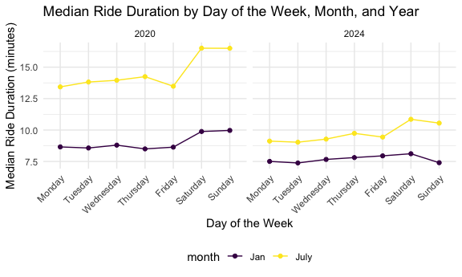

p8105_hw3_zo2168
================
Zhengkun Ou
2024-10-12

# Question 1

``` r
data("ny_noaa")
skimr::skim(ny_noaa)
```

|                                                  |         |
|:-------------------------------------------------|:--------|
| Name                                             | ny_noaa |
| Number of rows                                   | 2595176 |
| Number of columns                                | 7       |
| \_\_\_\_\_\_\_\_\_\_\_\_\_\_\_\_\_\_\_\_\_\_\_   |         |
| Column type frequency:                           |         |
| character                                        | 3       |
| Date                                             | 1       |
| numeric                                          | 3       |
| \_\_\_\_\_\_\_\_\_\_\_\_\_\_\_\_\_\_\_\_\_\_\_\_ |         |
| Group variables                                  | None    |

Data summary

**Variable type: character**

| skim_variable | n_missing | complete_rate | min | max | empty | n_unique | whitespace |
|:--------------|----------:|--------------:|----:|----:|------:|---------:|-----------:|
| id            |         0 |          1.00 |  11 |  11 |     0 |      747 |          0 |
| tmax          |   1134358 |          0.56 |   1 |   4 |     0 |      532 |          0 |
| tmin          |   1134420 |          0.56 |   1 |   4 |     0 |      548 |          0 |

**Variable type: Date**

| skim_variable | n_missing | complete_rate | min | max | median | n_unique |
|:---|---:|---:|:---|:---|:---|---:|
| date | 0 | 1 | 1981-01-01 | 2010-12-31 | 1997-01-21 | 10957 |

**Variable type: numeric**

| skim_variable | n_missing | complete_rate |  mean |     sd |  p0 | p25 | p50 | p75 |  p100 | hist  |
|:--------------|----------:|--------------:|------:|-------:|----:|----:|----:|----:|------:|:------|
| prcp          |    145838 |          0.94 | 29.82 |  78.18 |   0 |   0 |   0 |  23 | 22860 | ▇▁▁▁▁ |
| snow          |    381221 |          0.85 |  4.99 |  27.22 | -13 |   0 |   0 |   0 | 10160 | ▇▁▁▁▁ |
| snwd          |    591786 |          0.77 | 37.31 | 113.54 |   0 |   0 |   0 |   0 |  9195 | ▇▁▁▁▁ |

``` r
ny_noaa = janitor::clean_names(ny_noaa)
ny_noaa_1 <- 
  ny_noaa |>
  mutate(year = year(date),
         month = month(date),
         day = day(date),
         prcp = prcp / 10, # Convert precipitation from tenths of mm to mm
         tmax = as.numeric(tmax) / 10, #conver minumum temperature from tenths of degress C to degree C
         tmin = as.numeric(tmin) / 10  #Convert minimum temperature from tenths of degrees C to degrees C
  )
```

``` r
ny_noaa_1 |>
  count(snow) |>
  slice_max(n, n = 1)
```

    ## # A tibble: 1 × 2
    ##    snow       n
    ##   <int>   <int>
    ## 1     0 2008508

most oserved snowfall is 0.

``` r
month_jan_july = 
  ny_noaa_1 |>
  filter(month %in% c(1, 7))|>
  mutate(month = as.factor(month))

ave_tmax = 
  month_jan_july |> 
  group_by(id, year, month) |>
  filter(!is.na(tmax)) |>
  summarise(avg_tmax = mean(tmax, na.rm = TRUE))
```

    ## `summarise()` has grouped output by 'id', 'year'. You can override using the
    ## `.groups` argument.

``` r
ggplot(ave_tmax, aes(x = year, y = avg_tmax, aes(color = month))) +
  geom_point(aes(color = month)) + 
  facet_grid(~ month)
```


# Question 2

``` r
demo_df <- read_csv(file = "https://p8105.com/data/nhanes_covar.csv", 
                    skip = 4,
                    na = c(".", "NA",""))
```

    ## Rows: 250 Columns: 5
    ## ── Column specification ────────────────────────────────────────────────────────
    ## Delimiter: ","
    ## dbl (5): SEQN, sex, age, BMI, education
    ## 
    ## ℹ Use `spec()` to retrieve the full column specification for this data.
    ## ℹ Specify the column types or set `show_col_types = FALSE` to quiet this message.

``` r
acc_df <- read_csv("https://p8105.com/data/nhanes_accel.csv", )
```

    ## Rows: 250 Columns: 1441
    ## ── Column specification ────────────────────────────────────────────────────────
    ## Delimiter: ","
    ## dbl (1441): SEQN, min1, min2, min3, min4, min5, min6, min7, min8, min9, min1...
    ## 
    ## ℹ Use `spec()` to retrieve the full column specification for this data.
    ## ℹ Specify the column types or set `show_col_types = FALSE` to quiet this message.

``` r
demo_df = 
  demo_df |>
  mutate(SEQN = as.integer(SEQN))

acc_df = 
  acc_df |>
  mutate(SEQN = as.integer(SEQN))

demo_df_filtered <- 
  demo_df |>
  filter(age >= 21) |>
  filter(!is.na(sex) & !is.na(age) & !is.na(BMI) & !is.na(education)) |>
   mutate(
    sex = as.factor(sex),
    education = as.factor(education),
    BMI = as.numeric(BMI)
  )
  


#ensures that only participants who have both accelerometer data and demographic data are retained.
final_dataset_inner <- acc_df %>%
  inner_join(demo_df_filtered, by = "SEQN")

final_dataset <- final_dataset_inner |>
  relocate(SEQN, sex, education, BMI, age)
head(final_dataset)
```

    ## # A tibble: 6 × 1,445
    ##    SEQN sex   education   BMI   age  min1  min2  min3  min4   min5   min6  min7
    ##   <int> <fct> <fct>     <dbl> <dbl> <dbl> <dbl> <dbl> <dbl>  <dbl>  <dbl> <dbl>
    ## 1 62161 1     2          23.3    22 1.11  3.12  1.47  0.938 1.60   0.145  2.10 
    ## 2 62164 2     3          23.2    44 1.92  1.67  2.38  0.935 2.59   5.22   2.39 
    ## 3 62169 1     2          20.1    21 5.85  5.18  4.76  6.48  6.85   7.24   6.12 
    ## 4 62174 1     3          33.9    80 5.42  3.48  3.72  3.81  6.85   4.45   0.561
    ## 5 62177 1     2          20.1    51 6.14  8.06  9.99  6.60  4.57   2.78   7.10 
    ## 6 62178 1     2          28.5    80 0.167 0.429 0.131 1.20  0.0796 0.0487 0.106
    ## # ℹ 1,433 more variables: min8 <dbl>, min9 <dbl>, min10 <dbl>, min11 <dbl>,
    ## #   min12 <dbl>, min13 <dbl>, min14 <dbl>, min15 <dbl>, min16 <dbl>,
    ## #   min17 <dbl>, min18 <dbl>, min19 <dbl>, min20 <dbl>, min21 <dbl>,
    ## #   min22 <dbl>, min23 <dbl>, min24 <dbl>, min25 <dbl>, min26 <dbl>,
    ## #   min27 <dbl>, min28 <dbl>, min29 <dbl>, min30 <dbl>, min31 <dbl>,
    ## #   min32 <dbl>, min33 <dbl>, min34 <dbl>, min35 <dbl>, min36 <dbl>,
    ## #   min37 <dbl>, min38 <dbl>, min39 <dbl>, min40 <dbl>, min41 <dbl>, …

``` r
gender_education_table <- 
  final_dataset %>%
  group_by(sex, education) %>%
  count(name = "num_of_participants") %>%
  arrange(education)

knitr::kable(gender_education_table)
```

| sex | education | num_of_participants |
|:----|:----------|--------------------:|
| 1   | 1         |                  27 |
| 2   | 1         |                  28 |
| 1   | 2         |                  35 |
| 2   | 2         |                  23 |
| 1   | 3         |                  56 |
| 2   | 3         |                  59 |

``` r
ggplot(final_dataset, aes(x = age, fill = sex)) +
  geom_density(alpha = 0.6) +
  facet_grid(sex ~ education) +
  labs(
    title = "Age Distribution by Sex and Education Level",
    x = "Age (years)",
    y = "Count",
    fill = "Sex"
  ) +
  theme_minimal()
```


``` r
ggplot(final_dataset, aes(x = age, fill = sex)) +
  geom_histogram(binwidth = 3, position = "dodge", alpha = 0.8) +
  facet_grid(sex ~ education) +
  labs(
    title = "Age Distribution by Sex and Education Level",
    x = "Age (years)",
    y = "Count",
    fill = "Sex"
  ) 
```


Both two plots makes sense in terms of seeing the distribution. In
education group 1, there are no much difference between the male and
female in terms of the age distribution. For group 2, there are more
poeple in sex 1 and less people in age 2. In group 3, people with sex =
2 had more of people from 20 - 40 years old. Both two sex groups have
more people in the third group.

``` r
#group by the SEQN then use inner_join add the corresponding age, name, etc. 
long_act <- 
  final_dataset |>
  pivot_longer(cols = starts_with("min"), 
               names_to = "minute", 
               values_to = "activity",
               names_prefix = "min") |>
  group_by(SEQN) |> 
  summarise(total_act = sum(activity, na.rm = TRUE)) |>
  inner_join(demo_df_filtered, by = "SEQN")
```

``` r
ggplot(long_act, aes(x = age, y = total_act, color = sex)) +
  geom_point(alpha = 0.5) +
  geom_smooth(se = FALSE) +
  facet_wrap(~ education) + 
  labs(
    title = "Total Activity vs Age by Sex and Education Level",
    x = "Age (years)",
    y = "Total Activity",
    color = "Sex")
```

    ## `geom_smooth()` using method = 'loess' and formula = 'y ~ x'


## Trends in Total Activity by Age:

The plot shows total activity (y-axis) against age (x-axis) for
participants, separated by education level. The trend lines suggest that
total activity tends to decline with age across all education levels,
but there are some nuances depending on education and gender. \##
Differences by Sex: The lines represent men (sex = 1) and women (sex =
2). It appears that, in general, women (yellow line) tend to have a
slightly higher total activity level compared to men (purple line)
across most education categories, especially for younger participants.
This may indicate that women are relatively more active at younger ages,
though activity drops for both sexes with age. \## Education Categories:
The three panels represent different education levels. The difference
between the trend lines for men and women varies by education. For
example: In education level 1, women tend to have higher activity at
younger ages but converge with men at older ages. In education level 3,
both men and women show similar activity trends with age, but there
seems to be more variability for women. \## Patterns of Activity
Decline: Across all education levels, there is a noticeable decline in
activity as age increases. This is a common finding, as physical
activity tends to decrease with aging. Participants with higher
education levels appear to have more consistent activity levels
throughout their age range, while those with lower education show more
variability.

``` r
activity_long <- 
  final_dataset %>%
  pivot_longer(cols = starts_with("min"), 
               names_to = "minute", 
               values_to = "activity", 
               names_prefix = "min") |>
  mutate(minute = as.numeric(minute))
  
activity_long
```

    ## # A tibble: 328,320 × 7
    ##     SEQN sex   education   BMI   age minute activity
    ##    <int> <fct> <fct>     <dbl> <dbl>  <dbl>    <dbl>
    ##  1 62161 1     2          23.3    22      1    1.11 
    ##  2 62161 1     2          23.3    22      2    3.12 
    ##  3 62161 1     2          23.3    22      3    1.47 
    ##  4 62161 1     2          23.3    22      4    0.938
    ##  5 62161 1     2          23.3    22      5    1.60 
    ##  6 62161 1     2          23.3    22      6    0.145
    ##  7 62161 1     2          23.3    22      7    2.10 
    ##  8 62161 1     2          23.3    22      8    0.509
    ##  9 62161 1     2          23.3    22      9    1.63 
    ## 10 62161 1     2          23.3    22     10    1.20 
    ## # ℹ 328,310 more rows

``` r
ggplot(activity_long, aes(x = minute, y = activity, color = sex)) +
  geom_smooth(se = FALSE) + 
  facet_wrap(~ education) +
  labs(
    title = "24-Hour Activity Time by Education Level",
    x = "Minute of the Day",
    y = "Average Activity (MIMS)",
    color = "Sex"
  ) +
  theme_minimal()
```

    ## `geom_smooth()` using method = 'gam' and formula = 'y ~ s(x, bs = "cs")'


Description of patterns or conclusions based on the plot: There are
notable activity peaks during specific times of the day. Activity levels
tend to be lower during midnight hours. sex 2 tends to have slightly
higher average activity levels during peak times compared to sex 1,
especially for higher levels of educaition level 3. education level 3
shows more consistent activity patterns, while education level 1 shows
greater variability. Adding the smooth trend lines helps to better
visualize differences between sex 1 and sex 2, showing that sex 2 tends
to maintain higher activity during peak periods, especially for
education level 3.

# Question 3

``` r
jan_2020 <- read_csv("./citibike/Jan 2020 Citi.csv", na = c(".", "NA","")) |>
  janitor::clean_names() |>
  mutate(month = "Jan", year = 2020)
```

    ## Rows: 12420 Columns: 7
    ## ── Column specification ────────────────────────────────────────────────────────
    ## Delimiter: ","
    ## chr (6): ride_id, rideable_type, weekdays, start_station_name, end_station_n...
    ## dbl (1): duration
    ## 
    ## ℹ Use `spec()` to retrieve the full column specification for this data.
    ## ℹ Specify the column types or set `show_col_types = FALSE` to quiet this message.

``` r
jan_2024 <- read_csv("./citibike/Jan 2024 Citi.csv", na = c(".", "NA","")) |>
  janitor::clean_names()|>
  mutate(month = "Jan", year = 2024)
```

    ## Rows: 18861 Columns: 7
    ## ── Column specification ────────────────────────────────────────────────────────
    ## Delimiter: ","
    ## chr (6): ride_id, rideable_type, weekdays, start_station_name, end_station_n...
    ## dbl (1): duration
    ## 
    ## ℹ Use `spec()` to retrieve the full column specification for this data.
    ## ℹ Specify the column types or set `show_col_types = FALSE` to quiet this message.

``` r
july_2020 <- read_csv("./citibike/July 2020 Citi.csv", na = c(".", "NA","")) |>
  janitor::clean_names()|>
  mutate(month = "July", year = 2020)
```

    ## Rows: 21048 Columns: 7
    ## ── Column specification ────────────────────────────────────────────────────────
    ## Delimiter: ","
    ## chr (6): ride_id, rideable_type, weekdays, start_station_name, end_station_n...
    ## dbl (1): duration
    ## 
    ## ℹ Use `spec()` to retrieve the full column specification for this data.
    ## ℹ Specify the column types or set `show_col_types = FALSE` to quiet this message.

``` r
july_2024 <- read_csv("./citibike/July 2024 Citi.csv", na = c(".", "NA","")) |>
  janitor::clean_names()|>
  mutate(month = "July", year = 2024)
```

    ## Rows: 47156 Columns: 7
    ## ── Column specification ────────────────────────────────────────────────────────
    ## Delimiter: ","
    ## chr (6): ride_id, rideable_type, weekdays, start_station_name, end_station_n...
    ## dbl (1): duration
    ## 
    ## ℹ Use `spec()` to retrieve the full column specification for this data.
    ## ℹ Specify the column types or set `show_col_types = FALSE` to quiet this message.

``` r
citibike_data <- bind_rows(jan_2020, jan_2024, july_2020, july_2024)

#remove the null value with no start_name and end_name
citibike_data <- 
  citibike_data |>
  filter(!is.na(start_station_name) & !is.na(end_station_name))

#make sure no duplicate info, and change the variable type to facotr
citibike_data <- citibike_data |>
  distinct() |>
  mutate(rideable_type = as.factor(rideable_type), 
         weekdays = as.factor(weekdays),
         member_casual = as.factor(member_casual),
         month = as.factor(month)) |>
  relocate(ride_id,  member_casual, rideable_type, year, month, weekdays,start_station_name, end_station_name, duration)

head(citibike_data)
```

    ## # A tibble: 6 × 9
    ##   ride_id    member_casual rideable_type  year month weekdays start_station_name
    ##   <chr>      <fct>         <fct>         <dbl> <fct> <fct>    <chr>             
    ## 1 4BE06CB33… member        classic_bike   2020 Jan   Tuesday  Columbus Ave & W …
    ## 2 26886E034… member        classic_bike   2020 Jan   Wednesd… 2 Ave & E 96 St   
    ## 3 24DC56060… member        classic_bike   2020 Jan   Friday   Columbia St & Riv…
    ## 4 EEDC10535… member        classic_bike   2020 Jan   Sunday   W 84 St & Columbu…
    ## 5 2CD4BD4CE… member        classic_bike   2020 Jan   Friday   Forsyth St & Broo…
    ## 6 E18682F9A… member        classic_bike   2020 Jan   Sunday   Allen St & Hester…
    ## # ℹ 2 more variables: end_station_name <chr>, duration <dbl>

`ride_id (<chr>)`: Unique identifier for each bike ride.
`rideable_type (<fctr>)`: Type of bike used during the ride. It is
categorized as a factor with types like “classic_bike” or other
available bike types. `weekdays (<fctr>)`: The day of the week on which
the ride took place. This information is stored as a factor, which will
be useful for analyzing ride patterns on different days.
`duration (<dbl>)`: Duration of the ride in minutes. This numeric value
(<dbl>) can be used to analyze the length of rides over different days,
times, or across different user types. `start_station_name (<chr>)`:
Name of the station where the ride started. `end_station_name (<chr>)`:
Name of the station where the ride ended. `member_casual (<fctr>)`:
Rider type, either “member” or “casual.” This column is also a factor
`month` and `year` are added for future use, month are changed into
factor variable Dataset Features: The dataset has been filtered to
remove rows with missing values for start_station_name and
end_station_name, ensuring all rides have a recorded start and end
location. No Duplicate Records: Duplicates have been removed Categorical
Data as Factors: Columns such as rideable_type, weekdays, month, and
member_casual are transformed into factors.

``` r
ride_counts <- citibike_data %>%
  group_by(year, month, member_casual) %>%
  count(name = "total_rides")
knitr::kable(ride_counts)
```

| year | month | member_casual | total_rides |
|-----:|:------|:--------------|------------:|
| 2020 | Jan   | casual        |         980 |
| 2020 | Jan   | member        |       11418 |
| 2020 | July  | casual        |        5625 |
| 2020 | July  | member        |       15388 |
| 2024 | Jan   | casual        |        2094 |
| 2024 | Jan   | member        |       16705 |
| 2024 | July  | casual        |       10843 |
| 2024 | July  | member        |       36200 |

## Higher Usage Among Members:

Across all observed months and years, Citi Bike members consistently
outnumber casual riders in terms of total rides. This suggests that
members are the main users of the Citi Bike system, whereas casual
riders may use it occasionally \## Seasonal Trends: There is a
significant increase in rides during July compared to January,
indicating that weather plays an important role in bike usage. Warmer
months, such as July, see more usage. For both 2020 and 2024, July has a
much higher number of rides compared to January. For example, in July
2020, members took 15,388 rides, whereas in January of the same year,
they took only 11,418 rides. \## Growth in Usage from 2020 to 2024:
Comparing 2020 and 2024, there is an increase in the total number of
rides for both members and casual riders in each comparable month. For
instance, the number of member rides in January increased from 11,418 in
2020 to 16,705 in 2024, and the number of casual rides in July increased
from 5,625 in 2020 to 10,843 in 2024. This indicates that the overall
popularity of the Citi Bike system has grown significantly over time.
\## Member Growth: The growth rate in member rides appears to be much
stronger compared to that of casual rides, especially evident in July
2024, where member rides reached 36,200, more than double that of July
2020. \## Fluctuating Casual Rider Trends: Casual rider counts have also
increased, but the growth is not as pronounced as for members. For
instance, casual rides increased from 980 in January 2020 to 2,094 in
January 2024, suggesting a moderate uptake in occasional use, likely
tied to factors such as tourism or occasional commuting.

``` r
five_most_popu_start = citibike_data |>  
  filter(month == "July" & year == 2024) |>
  count(start_station_name, name = "count") |> 
  slice_max(order_by = count, n = 5) 
knitr::kable(five_most_popu_start, caption = "Top 5 Most Popular Starting Stations for July 2024")
```

| start_station_name       | count |
|:-------------------------|------:|
| Pier 61 at Chelsea Piers |   163 |
| University Pl & E 14 St  |   155 |
| W 21 St & 6 Ave          |   152 |
| West St & Chambers St    |   150 |
| W 31 St & 7 Ave          |   145 |

Top 5 Most Popular Starting Stations for July 2024

``` r
median_duration <- citibike_data |>
   mutate(weekdays = factor(weekdays, 
                            levels = c("Monday", "Tuesday", "Wednesday", "Thursday", "Friday", "Saturday", "Sunday"))) |>
  group_by(year, month, weekdays) |>
  summarise(median_duration = median(duration, na.rm = TRUE)) 
```

    ## `summarise()` has grouped output by 'year', 'month'. You can override using the
    ## `.groups` argument.

``` r
ggplot(median_duration, aes(x = weekdays, y = median_duration, fill = month)) +
  geom_bar(stat = "identity", position = "dodge", width = 0.6) +
  facet_wrap(month~ year) +
  labs(title = "Median Ride Duration by Day of the Week, Month, and Year",
       x = "Day of the Week",
       y = "Median Ride Duration (minutes)",
       fill = "Month") +
  theme(axis.text.x = element_text(angle = 45, hjust = 1)) 
```



``` r
citibike_2024 <- citibike_data %>% filter(year == 2024)

# Create a violin plot to visualize the distribution of ride durations by bike type, month, and member status
ggplot(citibike_2024, aes(x = member_casual, y = duration, fill = rideable_type)) +
  geom_violin(alpha = 0.7) +
  facet_wrap(~ month) +
  labs(title = "Ride Duration Distribution by Membership Status, Month, and Bike Type (2024)",
       x = "Membership Status",
       y = "Ride Duration (minutes)",
       fill = "Bike Type") 
```


## Difference in Ride Duration Between Members and Casual Riders:

Casual Riders: The distribution of ride durations for casual riders
shows that many casual rides are longer compared to members, especially
in the tail of the distribution. Members: For members, the distribution
of ride durations is more concentrated around shorter times, which
suggests that members primarily use Citi Bikes for shorter commutes. \##
Seasonal Differences (January vs. July): The overall shape of the
distributions between January and July is relatively similar for both
casual riders and members, but there are subtle differences: In July,
ride durations for both casual and member riders tend to be slightly
longer compared to January. This is expected because July typically
offers better weather. For casual riders, the distributions for July are
wider, indicating a greater variety in ride durations, which may imply
more leisure and exploratory rides in the warmer month. \## Impact of
Bike Type: Different Bike Types: The plot is filled with colors
representing different bike types. For both casual and member riders,
the distributions for classic and electric bikes overlap, but there are
some differences: The electric bike (yellow color) distributions appear
to have a slightly longer tail compared to classic bikes (purple color),
indicating that electric bikes are potentially used for both longer and
more varied rides by casual riders. The spread of ride duration for
electric bikes suggests that they are popular among casual riders for
longer trips, possibly due to their ease of use and less physical effort
required.
